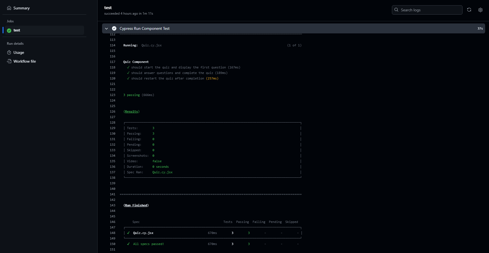
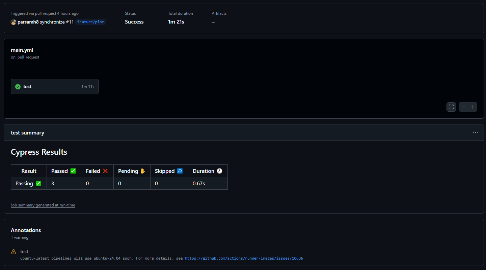

# DevOpsPipe

  
  

## Description

This MERN app features a CI/CD pipeline powered by GitHub Actions to ensure code quality and streamline development. Automated tests run on pull requests to catch issues early, while successful merges into the main branch trigger automatic deployments. This setup promotes reliable application performance, simplifies deployment, and enables rapid, confident feature development.

## Table of Contents

- [DevOpsPipe](#devopspipe)
  - [Description](#description)
  - [Table of Contents](#table-of-contents)
  - [Installation](#installation)
  - [Usage](#usage)
  - [Tests](#tests)
  - [License](#license)
  - [Contributing](#contributing)

## Installation

 - Node.js (v16 or later recommended)
 - Npm or yarn package manager
 - MongoDB (local or cloud instance)

## Usage

1. Feature Development:
   - Work on your feature in a separate branch.
   - Push your branch to the `develop` branch to trigger Continuous Integration (CI). Automated tests will run to ensure code quality.

2. Code Review and Merge:
   - Once tests pass, create a Pull Request (PR) to merge your feature branch into the main branch.
   - Merging into `main` triggers Continuous Deployment (CD), automatically deploying the updated application to the production environment.

This workflow guarantees that every change to the codebase is thoroughly tested before being integrated, reducing the risk of introducing bugs or regressions. By automating the testing process during Continuous Integration (CI), developers can catch and resolve issues early. The seamless deployment process in Continuous Deployment (CD) ensures that only tested and approved code reaches the production environment, maintaining the application's stability and reliability. Additionally, this structured approach promotes efficient collaboration among team members by providing a clear process for feature development, review, and deployment, ensuring smoother coordination and faster delivery of updates.

## Tests

Application tested with Cypress.

## License

This project is licensed under the MIT License.

## Contributing

For questions or support, reach out via:

Email: parsamh8@gmail.com  
GitHub: [parsamh](https://github.com/parsamh8) 